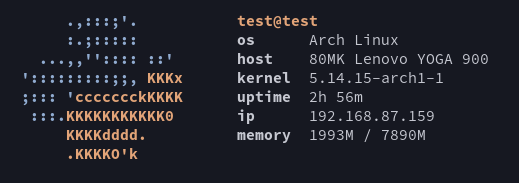

# pyfetch



**pyfetch** is a system information tool written in python.

## Usage

Currently **pyfetch** is only compatible with Linux systems.

```sh
git clone https://github.com/luovkle/pyfetch.git
cd pyfetch
chmod +x pyfetch.py
./pyfetch.py
```
